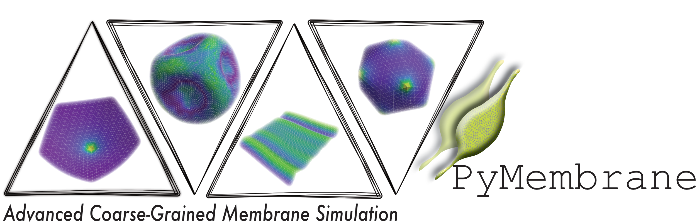

  

# PyMembrane

## Getting Started

PyMembrane combines a C++ backend with a Python interface. The recommended workflow is to install the package into a conda environment and run the packaged examples directly from the installed Python namespace.

### Installation

PyMembrane builds a CPU C++ extension through CMake and pybind11. A C++14-capable compiler is required.

Create an environment with the build dependencies:

bash conda create -n pymemb python=3.8 numpy cmake pybind11 conda activate pymemb 

Install PyMembrane from the repository root:

bash pip install -e . python -c "import pymembrane; print(pymembrane.__file__)" python -c "from pymembrane import *; print('import ok')" 

For a clean rebuild after native C++ changes:

bash rm -rf build *.egg-info pip install -e . 

For a non-editable install:

bash pip uninstall -y pymembrane rm -rf build *.egg-info pip install . python -c "import pymembrane; print(pymembrane.__file__)" python -c "from pymembrane import *; print('import ok')" 

If installation fails, first check that the active environment contains a C++ compiler, CMake, pybind11, and NumPy. PyMembrane does not require VTK for the default installation.

Offline documentation can also be bundled into the installed package. Build the
HTML docs first, then copy them into the package bundle before building or
installing:

bash sphinx-build -b html ./docs ./docs/_build/html python scripts/sync_offline_docs.py pip install . python -m pymembrane.docs --open 

### Running Examples

Packaged examples are available under pymembrane.examples and can be run from any working directory after installation:

bash python -m pymembrane.examples.periodic --quick python -m pymembrane.examples.minimizer --quick python -m pymembrane.examples.buckling --quick python -m pymembrane.examples.disclination --quick 
bash python -m pymembrane.examples.size_scaling --quick python -m pymembrane.examples.liquid_membrane --quick

Liquid membrane: demonstrates dynamic triangulation with Monte Carlo edge flips.

For example, from outside the repository:

bash cd /tmp python -m pymembrane.examples.periodic --quick 

The --quick flag runs a short version of each example suitable for checking the installation and example workflow. It reduces runtime while keeping the same physical setup, force models, and simulation workflow as the full example.

The size-scaling example generates spherical meshes of increasing resolution and times mesh generation, Monte Carlo vertex moves, and Brownian dynamics. The ``--quick`` option is intended as a quick check; for more stable timings, increase ``--steps`` and keep ``--repeat 3`` or larger.

The documentation source scripts are kept under docs/examples; the installed runnable versions live under pymembrane.examples and carry their runtime input files with them.

### Visualizing Results

Examples write mesh output using PyMembrane’s dumper interface:

python system.dumper.vtk("output") system.dumper.obj("output") 

The default dumper writes legacy ASCII VTK files directly from Python, so the VTK Python package is not required. The resulting .vtk files can be opened in ParaView or other tools that support legacy VTK POLYDATA files. OBJ output is also available for lightweight geometry inspection.

### Minimal Workflow

A typical PyMembrane script follows this structure:

python from pymembrane import Box, System, Evolver  box = Box(50.0, 50.0, 50.0) system = System(box) system.read_mesh_from_files(     files={         "vertices": "vertices.dat",         "faces": "faces.dat",     } )  evolver = Evolver(system) evolver.add_force("Mesh>Harmonic", {"k": {"0": "100.0"}, "l0": {"0": "1.0"}}) evolver.add_integrator("Mesh>MonteCarlo>vertex>move", {"dr": "0.01"}) evolver.set_global_temperature("1e-6") evolver.evolveMC(steps=100)  system.dumper.vtk("output") 

See the packaged examples for complete, runnable versions of the simulations discussed in the documentation and manuscript.
