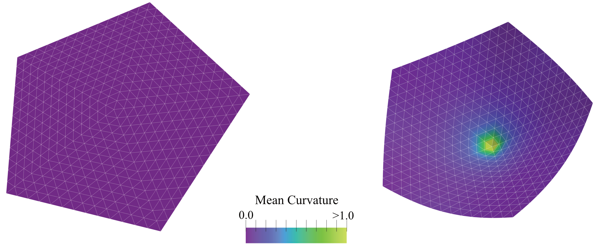

+1 Disclination Buckling: A PyMembrane Tutorial
===============================================

    
    Figure: Snapshots of a Monte Carlo simulation of an open +1 disclination that shows buckling into a conical shape. (Left) the initial flat configuration; (Right) the relaxed buckled configuration. The colour bar represents the local mean curvature of the mesh.

Introduction
------------
We start with the well-known problem in thin-sheet mechanics that studies out-of-plane buckling of a +1 disclination~\cite{Seung88}. This is a common phenomenon observed in mechanics and can be used to create interesting structures like cone-shaped party hats.

The Problem
-----------
For simplicity, we discuss the underlying physics using the discrete version of the problem. Let's assume we have a hexagonal flat patch tiled by equilateral triangles. The hexagon is made of six equilateral triangular wedges. If we remove one wedge (i.e., a section of angle :math:`\pi/3\equiv2\pi/6`) and glue together the two free edges, the resulting plate will be a pentagon, with the vertex in the center having five nearest neighbors. This is a +1 disclination.

The elastic energy can be reduced if the patch is allowed to buckle out of the plane. This introduces some bending penalty but reduces the stretching energy. One can show that the buckling transition happens if the F\"oppl-von K\'arm\'an number :math:`YR^2/\kappa\ge154`~\cite{Nelson87, Seung88}, where :math:`Y` is Young's modulus, :math:`R` is the patch radius, and :math:`\kappa` is the bending rigidity.

Requirements
------------

.. note::
    This tutorial assumes that you have already installed PyMembrane. If not, please refer to the installation instructions in the :ref:`installation` section.

* Python
* NumPy
* Matplotlib
* SciencePlots

Running the Code
----------------

1. Save the provided code as :download:`disclination.py<./01_disclination/MC/disclination.py>`
2. Download or create your vertex and face input files, such as :download:`Input Files <./01_disclination/InputFiles.zip>`.
3. Run the script by executing:

   .. code-block:: bash

      python disclination.py --N PENTAGON_SIZE --snapshots N_SNAPSHOTS --run_steps N_RUN_STEPS

PyMembrane Implementation
--------------------------

.. code-block:: python

    import pymembrane as mb
    import numpy as np
    from pprint import pprint
    import argparse
    import matplotlib.pyplot as plt
    import matplotlib.ticker as ticker
    import scienceplots
    plt.style.use(['science'])

    ### Parse arguments
    ## Now we want to have X snapshots every X steps each
    parser = argparse.ArgumentParser(description="Please provide: snapshots and run_steps")
    ## Add arguments for snapshots and run_steps
    parser.add_argument("--snapshots", type=int, required=True, help="Number of snapshots")
    parser.add_argument("--run_steps", type=int, required=True, help="Number of run steps")
    parser.add_argument("--N", type=int, required=True, help="Pentagon Number size")

    user_args = parser.parse_args()
    # Access the parsed arguments
    snapshots = user_args.snapshots
    run_steps = user_args.run_steps
    N = user_args.N #pentagon size

    #create a system 
    box = mb.Box(40.0, 40.0, 40.0)

    system = mb.System(box)

    #check if the box is loaded correctly
    print(system.box)

    #read the mesh
    vertex_file = '../vertices_N' + str(N) + '.inp'
    face_file = '../faces_N' + str(N) + '.inp'
    system.read_mesh_from_files(files={'vertices':vertex_file, 'faces':face_file})

    #save the mesh to display
    #create dumper
    dump = system.dumper
    dump.vtk("initial mesh", False)

    #add the evolver class where the potentials and integrators are added
    evolver = mb.Evolver(system)

    #add the potentials in this case we will add bending and stretching 
    # stretching 
    k = str(100.0)
    l0 = str(1.0)
    evolver.add_force("Mesh>Harmonic", {"k":{"0":k}, 
                                        "l0":{"0":l0}})

    # limit potential
    lmin = str(0.7)
    lmax = str(1.3)
    evolver.add_force("Mesh>Limit", {"lmin":{"0":lmin}, 
                                    "lmax":{"0":lmax}})
    # bending potential
    kappa = str(1.0)
    evolver.add_force("Mesh>Bending>Dihedral", {"kappa":{"0":kappa}})

    #Print the loaded forces
    pprint(evolver.get_force_info())

    # vertex move:
    # first we need to know the edge length to move it appropriate:
    compute = system.compute
    edge_lengths = compute.edge_lengths()
    avg_edge_length= np.mean(edge_lengths)
    print("[Initial] avg_edge_length = ", avg_edge_length)

    #add the monte carlo integrator
    evolver.add_integrator("Mesh>MonteCarlo>vertex>move", {"dr":"0.008"})

    ## Compute the initial energy
    mc_energy = snapshots*[None]
    mc_energy[0] = 100.0*compute.energy(evolver)['edges']/system.Numedges
    print("[Initial] energy = {} x 10^-2".format(mc_energy[0]))

    dump.vtk("pentagon_t0")
    for snapshot in range(1, snapshots):
        for temperature in [1e-3, 1e-5, 1e-7, 0.0]: #using heating and cooling cycles
            evolver.set_global_temperature(str(temperature))
            evolver.evolveMC(steps=run_steps)
        dump.vtk("pentagon_t" + str(snapshot*run_steps))
        mc_energy[snapshot] =  100.0*compute.energy(evolver)['edges']/system.Numedges
        print("[{}] energy = {} x 10^-2".format(snapshot,  mc_energy[snapshot]))

    dump.vtk('final_mesh')

    edge_lengths = compute.edge_lengths()
    avg_edge_length= np.mean(edge_lengths)
    print("[Final] avg_edge_length = ", avg_edge_length)

    energy = compute.energy(evolver)
    print("[Final] energy = ", mc_energy[snapshots-1])

    dump.txt("pentagon")

    fig, ax = plt.subplots(figsize=(3.3,3.3))
    ax.plot(mc_energy, 'o-')
    ax.set_xlabel(r"$MC steps$", fontsize=10, labelpad = 2.5)
    ax.set_ylabel(r"$Energy/NumEdges \times 10^{-2}$", fontsize=11, labelpad = 2.5)
    ax.tick_params(axis='x', labelsize=8, pad = 4)
    ax.tick_params(axis='y', labelsize=8, pad = 4)
    ax.ticklabel_format(useMathText=True)
    ax.xaxis.set_major_formatter(ticker.ScalarFormatter())
    ax.yaxis.set_major_formatter(ticker.ScalarFormatter())
    plt.tight_layout()
    plt.savefig("energy.svg", dpi=400)

Explanation
-----------
1. **Initialization**: We start by importing necessary modules and parsing user arguments for snapshots, run steps, and pentagon size.
2. **System Creation**: A simulation box and system instance are created and verified.
3. **Mesh Reading**: Mesh files are read, and initial mesh is saved.
4. **Evolver Setup**: The Evolver class is used to add potentials for stretching, limiting, and bending. The forces are printed for verification.
5. **Vertex Movement**: Monte Carlo integrator is added.
6. **Energy Computation**: Initial energy is computed, and the system evolves through snapshots. The energy is plotted and saved.

Result and Interpretation
-------------------------
This tutorial demonstrates how PyMembrane can be used to model a +1 planar disclination and understand its buckling transition. By following the simple workflow detailed in this tutorial, one can easily extend the simulation to other complex systems.

Attached Files
--------------

Monte Carlo Python script: :download:`Python Script <./01_disclination/MC/disclination.py>`

Input files: :download:`Input Files <./01_disclination/InputFiles.zip>`

Other two additional scripts for Brownian and Velocity Verlet integrators are also provided:

:download:`Brownian Python script <./01_disclination/Brownian/disclination.py>`

:download:`Velocity Verlet Python script <./01_disclination/Brownian/disclination.py>`

References
----------
.. [Seung88] Seung, H. S., & Nelson, D. R. (1988). Microstructure of two-dimensional disclinations. Physical Review A, 38(2), 1005.
.. [Nelson87] Nelson, D. R. (1987). Order, frustration, and defects in liquids and glasses. Physical Review B, 36(10), 5788.

Note
----
Please refer to the PyMembrane documentation for more specific details about classes and methods used in this tutorial. Feel free to modify parameters and observe how they influence the results.
