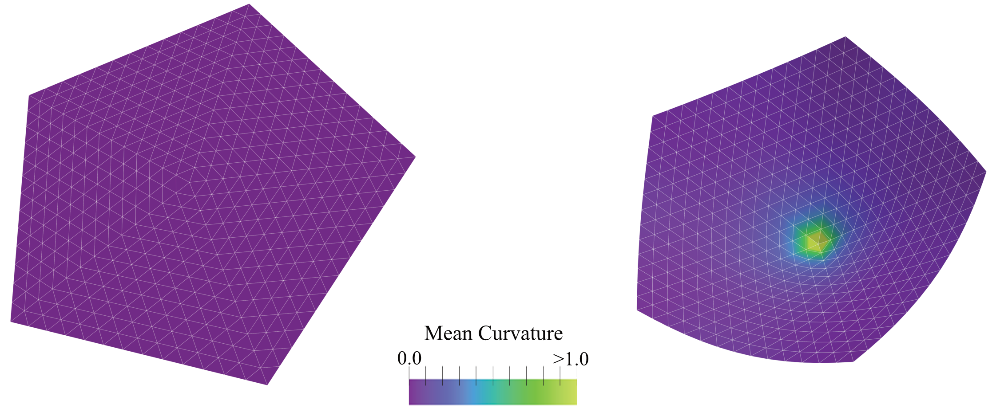

+1 Disclination Buckling: A PyMembrane Tutorial
===============================================

    
    Figure: Snapshots of a Monte Carlo simulation of an open +1 disclination that shows buckling into a conical shape. (Left) the initial flat configuration; (Right) the relaxed buckled configuration. The colour bar represents the local mean curvature of the mesh.

Introduction
------------

This example studies out-of-plane buckling of an open ``+1`` disclination, a
standard thin-sheet mechanics problem. In the triangulated mesh, the central
vertex has five neighbours instead of six, which introduces the elastic
frustration that drives buckling into a cone-like shape.

What This Example Demonstrates
------------------------------

All three packaged disclination examples use the same packaged input meshes
from ``InputFiles.zip`` and the same elastic forces: harmonic stretching, limit
protection, and dihedral bending. They differ only in the time-stepping or
sampling method:

- ``pymembrane.examples.disclination`` uses a Brownian vertex-move integrator.
- ``pymembrane.examples.disclination_mc`` uses a Monte Carlo vertex-move
  integrator with the documented annealing schedule.
- ``pymembrane.examples.disclination_verlet`` uses a velocity-Verlet
  integrator.

Each version writes ``initial mesh.vtk`` and ``pentagon_t*.vtk`` snapshots. The
Monte Carlo version also writes ``final_mesh.vtk``. ``--quick`` keeps the same
mesh, force model, and integrator choice, but reduces the number of steps and
snapshots.

The packaged module ``pymembrane.examples.hybrid_mc_bd`` demonstrates a
conservative hybrid workflow on the same physical problem. In each cycle it
first performs Brownian dynamics relaxation with
``Mesh>Brownian>vertex>move`` and then performs Monte Carlo sampling with
``Mesh>MonteCarlo>vertex>move`` before writing a VTK snapshot. ``--quick``
reduces the number of hybrid cycles and the MD/MC step counts, but does not
change the mesh, forces, or integrator names.

How to Run
----------

Brownian version:

.. code-block:: bash

   python -m pymembrane.examples.disclination --quick

Monte Carlo version:

.. code-block:: bash

   python -m pymembrane.examples.disclination_mc --quick

Velocity-Verlet version:

.. code-block:: bash

   python -m pymembrane.examples.disclination_verlet --quick

Hybrid Brownian + Monte Carlo version:

.. code-block:: bash

   python -m pymembrane.examples.hybrid_mc_bd --quick

All three commands also support ``--output-dir``:

.. code-block:: bash

   python -m pymembrane.examples.disclination --quick --output-dir results

The hybrid example supports the same output-directory option:

.. code-block:: bash

   python -m pymembrane.examples.hybrid_mc_bd --quick --output-dir results

Inputs
------

- packaged disclination meshes from ``InputFiles.zip``
- default mesh size parameter: ``N=14``
- output directory: current working directory unless ``--output-dir`` is used

Model Ingredients
-----------------

- mesh: open ``+1`` disclination mirrored under ``docs/examples/disclination*``
- forces: ``Mesh>Harmonic``, ``Mesh>Limit``, ``Mesh>Bending>Dihedral``
- integrators:

  Brownian: ``Mesh>Brownian>vertex>move``

  Monte Carlo: ``Mesh>MonteCarlo>vertex>move``

  Velocity-Verlet: ``Mesh>VelocityVerlet>vertex>move``

  Hybrid: alternating ``Mesh>Brownian>vertex>move`` and ``Mesh>MonteCarlo>vertex>move``

Expected Output
---------------

- ``initial mesh.vtk``
- ``pentagon_t0.vtk``
- additional ``pentagon_t*.vtk`` snapshots
- ``final_mesh.vtk`` for the Monte Carlo version
- ``initial_mesh.vtk`` and ``hybrid_t*.vtk`` for the hybrid example
- output format: legacy ASCII ``.vtk``

Quick Mode
----------

Quick mode keeps the same physical setup but reduces snapshot counts and the
number of MD or MC steps.

The mirrored source versions of these examples are kept under ``docs/examples``:

- ``docs/examples/disclination/__main__.py``
- ``docs/examples/disclination_mc/__main__.py``
- ``docs/examples/disclination_verlet/__main__.py``

The installed ``pymembrane.examples`` versions include the input data required
to run each example directly after installation.

How to visualize the result
---------------------------

Open the VTK files in ParaView to inspect the development of the conical shape.
Comparing the three integrator variants is useful for understanding how the
same physical setup relaxes under different update rules.

References
----------

.. [Seung88] Seung, H. S., & Nelson, D. R. (1988). Microstructure of two-dimensional disclinations. Physical Review A, 38(2), 1005.
.. [Nelson87] Nelson, D. R. (1987). Order, frustration, and defects in liquids and glasses. Physical Review B, 36(10), 5788.
