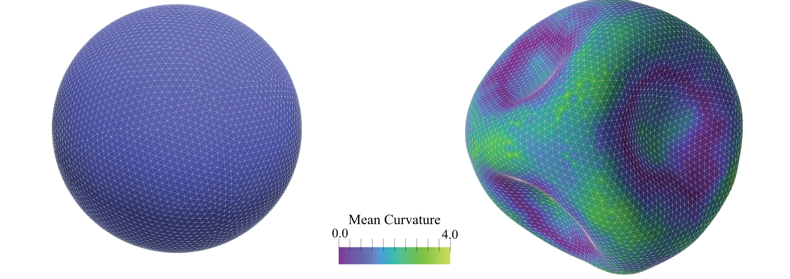

Constant Volume Energy Minimization Tutorial
============================================

    Figure: (Left) Initial configuration of a vesicle with unit radius comprising $N=6281$ vertices. The vesicle is subjected to a strain by increasing the edge rest length as $l_0 = (1+\epsilon) \left<l_e\right>$, where $\epsilon = 0.1$ and $\left<l_e\right>$ denotes the average edge length of the mesh. As a result, the vesicle buckles, leading to surface wrinkles, as depicted in (Right). The colour bar indicates the local mean curvature. The final shape of the vesicle, after energy minimization under volume constraint, is obtained using the FIRE method

Introduction
------------

This example performs constant-volume energy minimization of a closed elastic
vesicle. The example is useful when you want a deterministic relaxation step
instead of a dynamics or Monte Carlo trajectory.

What This Example Demonstrates
------------------------------

The example loads the packaged vesicle mesh files
``vertices_R1.0_l01.inp`` and ``faces_R1.0_l01.inp``, computes the average edge
length, increases the harmonic rest length to impose strain, adds a limit
force, adds dihedral bending, and then minimizes the energy with the
``Mesh>Fire`` minimizer while enforcing a constant-volume constraint. It writes
``initial mesh.vtk`` and ``minimization_t*.vtk`` snapshots. ``--quick`` keeps
the same physical scenario and parameters but reduces the number of snapshots
and FIRE iterations.

How to Run
----------

.. code-block:: bash

   python -m pymembrane.examples.minimizer --quick

To write outputs to a separate directory:

.. code-block:: bash

   python -m pymembrane.examples.minimizer --quick --output-dir results

Inputs
------

- packaged mesh files: ``vertices_R1.0_l01.inp`` and ``faces_R1.0_l01.inp``
- output directory: current working directory unless ``--output-dir`` is used

Model Ingredients
-----------------

- mesh: closed vesicle from ``docs/examples/04_minimization``
- forces: ``Mesh>Harmonic``, ``Mesh>Limit``, ``Mesh>Bending>Dihedral``
- minimizer: ``Mesh>Fire``
- constraint: ``Mesh>Volume``
- boundary condition: non-periodic

Expected Output
---------------

- ``initial mesh.vtk``
- ``minimization_t0.vtk``
- additional ``minimization_t*.vtk`` snapshots
- output format: legacy ASCII ``.vtk``

Quick Mode
----------

Quick mode keeps the same model and constraint, but reduces snapshots and FIRE
iterations.

The source version of this example is kept under
``docs/examples/04_minimization/minimizer.py``. The installed version under
``pymembrane.examples.minimizer`` is the primary runnable interface.

Minimal Workflow
----------------

.. code-block:: python

   import numpy as np
   import pymembrane as mb

   box = mb.Box(40, 40, 40)
   system = mb.System(box)
   system.read_mesh_from_files(files={"vertices": "vertices_R1.0_l01.inp", "faces": "faces_R1.0_l01.inp"})

   evolver = mb.Evolver(system)
   compute = system.compute
   edge_lengths = compute.edge_lengths()
   avg_edge_length = np.mean(edge_lengths)
   evolver.add_force("Mesh>Harmonic", {"k": {"0": "400.0"}, "l0": {"0": str(1.1 * avg_edge_length)}})
   evolver.add_force("Mesh>Limit", {"lmin": {"0": str(0.5 * np.min(edge_lengths))}, "lmax": {"0": str(2.0 * np.max(edge_lengths))}})
   evolver.add_force("Mesh>Bending>Dihedral", {"kappa": {"0": "1.0"}})
   evolver.add_minimizer("Mesh>Fire", {"dt": "1e-2", "max_iter": "2000", "ftol": "1e-2", "etol": "1e-4"})
   evolver.add_constraint("Mesh>Volume", {"V": str(compute.volume()), "max_iter": "10000", "tol": "1e-5"})
   evolver.minimize()
   system.dumper.vtk("output")

How to visualize the result
---------------------------

Open the VTK files in ParaView to compare the initial and minimized vesicle
shapes and inspect the wrinkled morphology.
