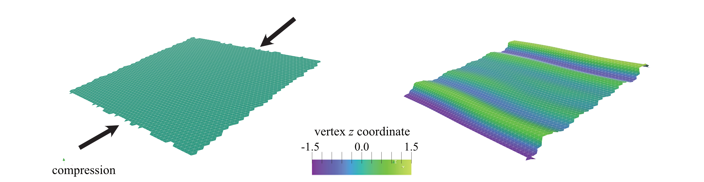

Periodic Boundary
=================

In many problems, probing finite-size effects is crucial, especially when modelling long-wavelength properties or when long-range interactions are present. Periodic boundary conditions are often used to replicate an infinite system by replicating the simulation box. This method ensures that particles exiting one side of the box re-enter from the opposite side.

PyMembrane provides a simple way to implement periodic boundary conditions. This tutorial demonstrates how to set up and run a simulation that models wrinkling in a periodic thin sheet subject to uniaxial compression.

Requirements
------------

.. note::
    This tutorial assumes that you have already installed PyMembrane. If not, please refer to the installation instructions in the :ref:`installation` section.

* Python
* NumPy
* Matplotlib
* SciencePlots

Running the Code
----------------

1. Save the provided code as :download:`periodic.py<./02_periodic/periodic.py>`
2. Download  :download:`vertices <./02_periodic/vertices.dat>`, :download:`faces <./02_periodic/faces.dat>`.
3. Run the script by executing:

   .. code-block:: bash

      python periodic.py --snapshots N_SNAPSHOTS --run_steps N_RUN_STEPS --epsilon EPSILON
      

Setting Up Periodic Boundary Conditions
---------------------------------------

To create a simulation box with periodic boundary conditions, you can use the ``Box`` class by setting the periodic flag to True.

.. code-block:: python

   import pymembrane as mb
   from math import sqrt
   box = mb.Box(sqrt(3.0)*29, 50.0, 50.0, True)
   print(box)

Next, create a system and read the mesh from the vertex and face files. Then, enforce the boundaries to ensure that all vertices are inside the box for periodic boundary conditions.

.. code-block:: python

   system = mb.System(box)
   system.read_mesh_from_files(files={'vertices': 'vertices.dat', 'faces': 'faces.dat'})
   system.enforce_boundaries()

Creating Forces and Integrators
-------------------------------

You can add forces for stretching, limiting, and bending by using the ``Evolver`` class.

.. code-block:: python

   # ... (code continuation)
   evolver = mb.Evolver(system)
   k = str(100.0)
   l0 = str(1.0)
   evolver.add_force("Mesh>Harmonic", {"k":{"0":k}, "l0":{"0":l0}})

   # ... (add more forces)

Uniaxial compression
--------------------

To implement uniaxial compression we create an auxiliary function whose primary role is to refresh or update the box size:

.. code-block:: python
   def compress_box(epsilon):
      new_box = Box(system.box.L.x*(1-epsilon), system.box.L.y, system.box.L.z, True)
      return new_box

Where epsilon is the strain ::math:`\epsilon = \frac{\vert L_0 - L \vert}{L_0}`.

Simulation and Visualization
----------------------------

You can now run a Brownian dynamics simulation while compressing the box and visualize the results.

.. code-block:: python

   # ... (code continuation)
   for snapshot in range(1, snapshots):
       evolver.evolveMD(steps=run_steps)
       #compress the box every run_steps until reach 50
       if snapshot<50:
         system.box = compress_box(epsilon)
         system.enforce_boundaries()
   # ... (final computation)

Results
-------

The periodic structure shows clear wrinkles, indicative of the system's response to compression. You can observe the visualized output in the generated VTK files.

   Figure: The periodic structure shows clear wrinkles on the surface.

Conclusion
----------

This tutorial demonstrated how to use PyMembrane to simulate a system with periodic boundary conditions. This approach can be useful in various applications, especially when long-range interactions or long-wavelength properties are relevant.

