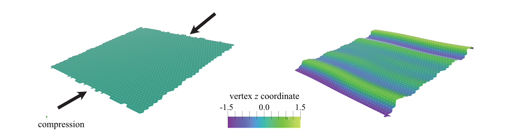

Periodic Boundary
=================

In many problems, probing finite-size effects is crucial, especially when
modelling long-wavelength properties or when long-range interactions are
present. Periodic boundary conditions are often used to replicate an infinite
system by replicating the simulation box. This example models wrinkling in a
periodic thin sheet subject to uniaxial compression.

What this example does
----------------------

This example loads the packaged mesh files ``vertices.dat`` and ``faces.dat``
from the periodic example data set, constructs a periodic box, applies
stretching, limiting, and dihedral bending forces, and evolves the mesh with a
Brownian vertex-move integrator while the box is compressed along one
direction. It writes ``initial_mesh.vtk`` and a sequence of
``periodic_t*.vtk`` files that can be inspected in ParaView or any other tool
that reads legacy VTK polygon data. ``--quick`` keeps the same physical setup
but reduces the number of snapshots and integration steps.

Primary run command
-------------------

After installing PyMembrane, run the packaged example from any working
directory:

.. code-block:: bash

   python -m pymembrane.examples.periodic --quick

To keep output files in a separate directory:

.. code-block:: bash

   python -m pymembrane.examples.periodic --quick --output-dir results

The source version of this example is kept under
``docs/examples/02_periodic/periodic.py``. The installed version under
``pymembrane.examples.periodic`` is the reviewer-facing entry point and avoids
manual path edits or data downloads.

Minimal workflow
----------------

The packaged script follows the standard PyMembrane workflow:

.. code-block:: python

   from math import sqrt
   import pymembrane as mb

   box = mb.Box(sqrt(3.0) * 29, 50.0, 50.0, True, True, True)
   system = mb.System(box)
   system.read_mesh_from_files(files={"vertices": "vertices.dat", "faces": "faces.dat"})
   system.enforce_boundaries()

   evolver = mb.Evolver(system)
   evolver.add_force("Mesh>Harmonic", {"k": {"0": "100.0"}, "l0": {"0": "1.0"}})
   evolver.add_force("Mesh>Limit", {"lmin": {"0": "0.7"}, "lmax": {"0": "1.3"}})
   evolver.add_force("Mesh>Bending>Dihedral", {"kappa": {"0": "1.0"}})
   evolver.add_integrator("Mesh>Brownian>vertex>move", {"seed": "202208"})
   evolver.set_time_step("2e-3")
   evolver.set_global_temperature("1e-4")
   evolver.evolveMD(steps=10)
   system.dumper.vtk("output", periodic=True)

Expected output
---------------

- ``initial_mesh.vtk``
- ``periodic_t0.vtk``
- additional ``periodic_t*.vtk`` snapshots

Quick mode usually completes in a few seconds on a laptop.

Results
-------

The periodic structure shows clear wrinkles, indicative of the system's
response to compression. You can observe the geometry in the generated VTK
files.

   Figure: The periodic structure shows clear wrinkles on the surface.
