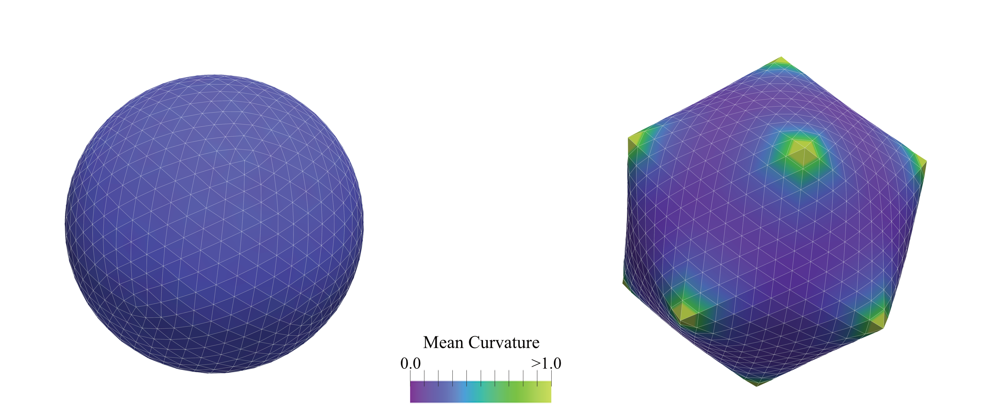

Caspar-Klug Thin Shells Buckling
================================

    Figure: Snapshots of a Monte Carlo simulation of an icosahedral closed shell, representing a virus with $T=108$ ($(p,q)=(6,6)$), according to the Caspar-Klug classification~\cite{caspar1962physical}. The material parameters are chosen such that the F\"oppl-von K\'arm\'an number is $\gamma \approx 400$. (Left) The sphere with 12 5-fold defects at the corners of an icosahedron prior to buckling; (Right) a buckled, faceted structure. The colour bar represents the local mean curvature of the mesh.

Introduction
------------

This example demonstrates how PyMembrane can be used to study buckling of
icosahedral thin shells. The mesh represents a Caspar-Klug shell with 12
five-fold disclinations, and the elastic parameters are chosen so that the
shell buckles from a nearly spherical shape into a faceted one.

What This Example Demonstrates
------------------------------

The example loads the packaged ``vertices.dat`` and ``faces.dat`` files for the
closed shell, adds harmonic stretching, limit, and dihedral bending forces, and
relaxes the shell with a Monte Carlo vertex-move integrator using the same
temperature cycle as the documented source script. It writes ``initial
mesh.vtk``, ``sphere_t*.vtk`` and ``final_mesh.vtk``. ``--quick`` keeps the
same physical model but reduces the number of snapshots and Monte Carlo steps.

How to Run
----------

.. code-block:: bash

   python -m pymembrane.examples.buckling --quick

To place the outputs in a separate directory:

.. code-block:: bash

   python -m pymembrane.examples.buckling --quick --output-dir results

Inputs
------

- packaged mesh files: ``vertices.dat`` and ``faces.dat``
- output directory: current working directory unless ``--output-dir`` is used

Model Ingredients
-----------------

- mesh: closed Caspar-Klug shell mirrored under ``docs/examples/buckling``
- forces: ``Mesh>Harmonic``, ``Mesh>Limit``, ``Mesh>Bending>Dihedral``
- integrator: ``Mesh>MonteCarlo>vertex>move``
- boundary condition: non-periodic

Expected Output
---------------

- ``initial mesh.vtk``
- ``sphere_t0.vtk``
- additional ``sphere_t*.vtk`` snapshots
- ``final_mesh.vtk``
- output format: legacy ASCII ``.vtk``

Quick Mode
----------

Quick mode keeps the same shell model but reduces snapshots and Monte Carlo
steps.

The mirrored source version of this example is kept under
``docs/examples/buckling/__main__.py``. The installed version
under ``pymembrane.examples.buckling`` includes the packaged input data.

How to visualize the result
---------------------------

Open the generated VTK files in ParaView to inspect the shell shape and compare
the early and late snapshots.

References
----------

.. [Lidmar03] J. Lidmar, L. Mirny, D. R. Nelson, Virus shapes and buckling transitions in spherical shells, Physical Review E 68 (2003)
   051910
