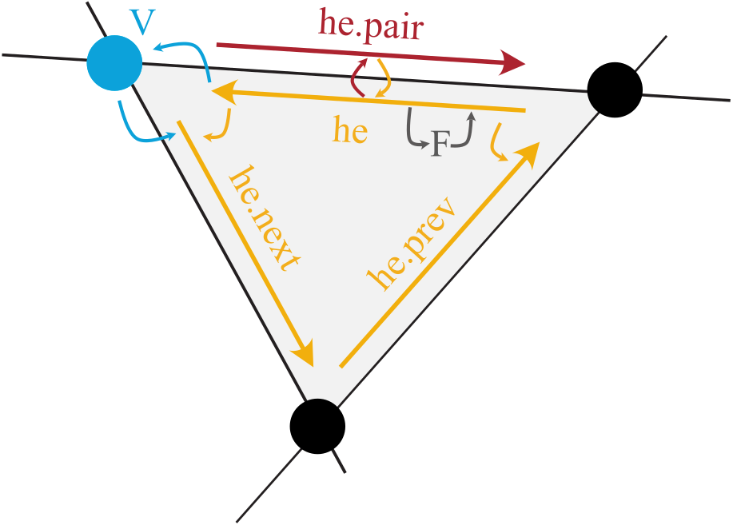

Halfedge Data Structure
=======================

.. contents::
   :local:
   :depth: 2

Introduction
------------

In **PyMembrane**, a sophisticated data structure known as the *halfedge data structure* is used to represent complex meshes. This data structure introduces a convenient way to organize the vertices, edges, and faces of a polygonal mesh. By augmenting the mesh components with additional entities called *halfedges*, we can achieve more efficient traversal and manipulation of the mesh.

Halfedge Structure
------------------

The essence of the halfedge data structure lies in the concept of splitting each edge of a face into two *twin directed half-edges*. This new entity, the *halfedge*, acts as a guide within each triangle, creating a network of interconnected edges that facilitate quick navigation within the mesh. The illustration below provides a visual representation:

Key Features
------------

The halfedge structure offers several key features that contribute to its efficiency:

- **Vertex and Face Relations**: Each halfedge stores information about its adjacent vertices and the corresponding face. This enables seamless navigation between vertices and faces.

- **Neighbor Connectivity**: Halfedges maintain pointers to their immediate neighbors – the succeeding and preceding halfedges within the same face. This connectivity streamlines traversing along edges within a face.

- **Twin Halfedges**: Every halfedge has a twin counterpart that shares the same pair of vertices. This pairing ensures consistent traversal between edges and their opposites.

Traversal Example
------------------

Here's a practical example of how to use the halfedge structure in **PyMembrane**:

.. code:: python

   # Create a system
   system = System()

   # Read the mesh from input files
   vertex_file = 'vertices.inp'
   face_file = 'faces.inp'
   mesh = {'vertices': vertex_file, 'faces': face_file}
   system.read_mesh_from_files(files=mesh)

   # Traverse edges connected to vertex 0
   vertex_index = 0
   he_first = system.vertices[vertex_index]._hedge
   he = he_first

   while True:
      print(system.halfedges[he].edge)
      # Move to the next edge
      he_pair = system.halfedges[he].pair
      he = system.halfedges[he_pair].next
      if he == he_first:
          break

Looping over halfedges
-----------------------

.. code-block:: python

   halfedges = system.getHalfedges()
   for index in range(len(halfedges)):
       halfedge = halfedges[index]
       ...

Halfedge methods
~~~~~~~~~~~~~~~~

- `boundary`: if true, the halfedge is a boundary
- `edge`: edge this halfedge is part of
- `face` face the half-edge borders
- `index` vertex at the beginning of the half-edge
- `next` next half-edge around the face
- `pair` oppositely oriented adjacent half-edge
- `prev` previous half-edge around the face
- `vert_from` vertex at the beginning of the half-edge
- `vert_to` vertex at the end of the half-edge